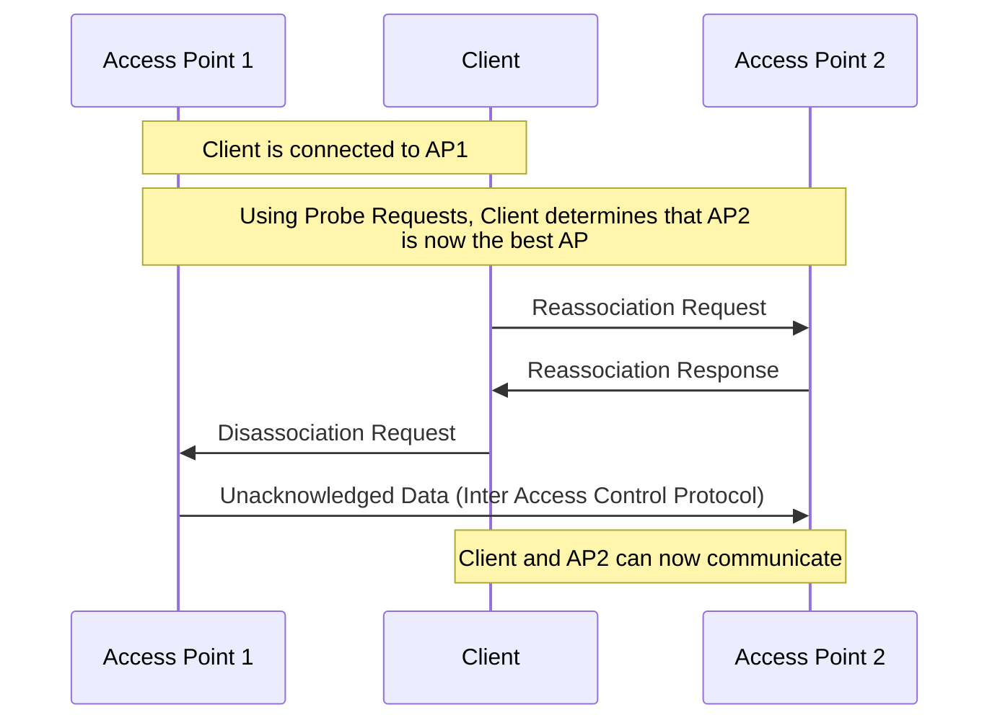

Wireless communication over WLAN is regulated in #IEEE/802-11.
## 2.4 GHz
There are 14 Channels available from 2.402 - 2.483 with a 22Mhz range each.

## Composition

> [!EXAMPLE]- Abbreviations
> AP: Access Point
> BSSID: Basic Service Set Identifier
> DS: Distribution System
> DA: Destination Address
> RA: Receiver Address
> SA: Source Address
> TA: Transmitter Address

### Layer 2 Datagram

| 2B | 2B | 6B | 6B | 6B | 2B | 6B | … | 4B |
| ---- | ---- | ---- | ---- | ---- | ---- | ---- | ---- | ---- |
| Frame control | Duration ID | Address 1 | Address 2 | Address 3 | Sequence control | Address 4 | Data | Frame check sequence |

- [[#Frame Control]]
- **Duration/ID**: Meaning depends Frame Type
	- **ID**: Used to get Data which is buffered at the AP and has been announced using a [[#Traffic Indication Maps (TIM)|TIM]]
	- **Duration**: Time in microseconds which is reserved for this frame and potential Acknowledgements.
- **Address 1**: RA, MAC address of the station (device) intended to receive the frame
- **Address 2**: TA, MAC address of the station that transmitted the frame
- **Address 3**: DA, Final destination MAC address of the frame
- **Sequence Control**: Consists of 4b Fragment number and 12b Sequence Number, where the the Fragment Number enumerates each Fragment sent while the Sequence Number stays constant for a transmission. Used to address frame losses/reordering during transmission.
- **Address 4**: SA, MAC address of the original source of the frame, which may be different from the transmitter

#### Frame Control

| 2b | 2b | 4b | 1b | 1b | 1b | 1b | 1b | 1b | 1b | 1b |
| ---- | ---- | ---- | ---- | ---- | ---- | ---- | ---- | ---- | ---- | ---- |
| Protocol Version | Type | Subtype | To DS | From DS | More Frag | Retry | Power Management | More Fragments | WEP | Reserved |

- To DS/From DS: If the frame is going to the access point (To DS bit set) or coming from the access Point (From DS bit set).
	- Most of the time, one of the two bits is set, although both bits set (Access Point to Access Point) or no bits set (Ad-Hoc Network) are possible.

## Channel Bonding
Channel bonding refers to the practice of combining multiple adjacent channels to increase the overall data transfer rate and improve network performance.

For example, in 40MHz channel bonding, two adjacent 20 MHz channels are combined into a single 40 MHz channel. This doubles the available bandwidth.

## CSMA/CA
See [[CMSA-CD#Wireless]]

## Management Frames

> [!NOTE]- Wireshark Captures
> ### Beacon
>  ![[Beacon Wireshark.png]]
>  ### Probe Request
>  ![[Probe Request Wireshark.png]]
>  ### Probe Response
>  ![[Probe Response Wireshark.png]]
>  ### Authentication Request
>  ![[Authentication Request.png]]
>  ### Authentication Response
>  ![[Authentication Response.png]]
>  ### Association Request
>  ![[Association Request.webp]]
>  ### Association Response (successful)
>  ![[Association Response.webp]]

### Beacon
Beacons are broadcast which are sent by a access point periodically. They contain all the information about the network. With these Frames, devices know what Capabilities, Speeds and more the wireless connection supports. They also contain Traffic Indication Maps

#### Traffic Indication Maps (TIM)
The Traffic Indication Map is a mechanism used in Wi-Fi networks to notify devices in power-save mode about the existence of buffered frames at the access point. These devices can then use a Probe Request to request the data using the Association ID.

### Probe Requests
Probe Requests are broadcasts sent by a device to locate nearby access points. APs will respond to a Probe Request with a Probe Response.

### Probe Responses
A response from an AP which has received A Probe Request. Mostly similar to a beacon, although no [[#Traffic Indication Maps (TIM)|TIM]] field is included.

### Association Process
Once a device has gathered Information about nearby APs using Beacons/Probe requests, it will select one AP to connect to.

#### Authentication Request & Response
A relatively simple Frame used to authenticate to Client with the AP.

In an Open System Authentication, there will be one Request and one response. In an Shared Key Authentication, there will be two Requests and two Responses.

#### Association Request & Response
Once a client has been authenticated, it will send an Association Request to the AP containing its Capabilities. The AP will then compare those capabilities. If it determines that Capabilities match and the client can join the network, it sends an Association Response containing an **Association ID**, which the Client can now use to communicate in the network.

##### Reassociation Request & Response
Contains the same Information as a association request/response.

#### Disassociation Frame
Dissociation frames are sent to terminate the connection. Can be sent from either AP or client.

> [!tldr] Data Rates
> All Management Frames get transmitted at the lowest data rate supported by the AP to ensure maximum capability.

## Roaming
#todo sticky client problem
Roaming is when a client moves from one AP to another. Roaming should be instant and not noticeable by the user.

However, in practice, this approach is rather slow.

### 802.11r
This IEEE Standard for Fast Roaming reduces the time it takes from one network to another.
